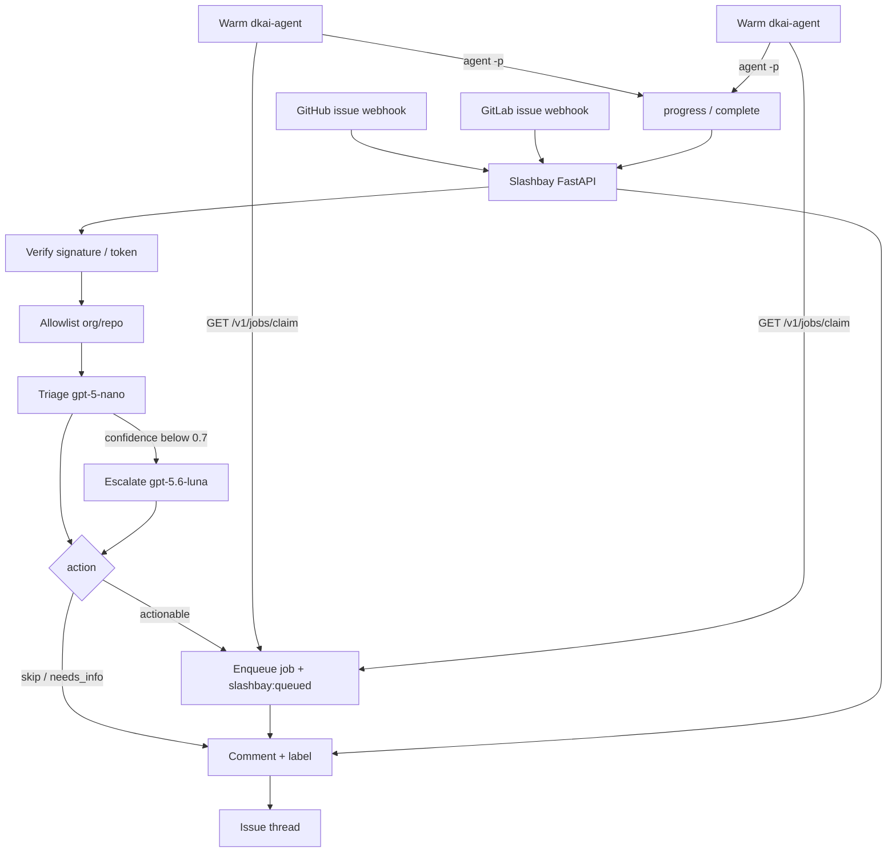
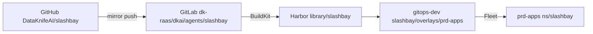

# Slashbay

**Slashbay** — DataKnifeAI’s issue-webhook herald and job queue: issues dock here, cheap-LLM triage decides if they are work, and **warm `dkai-agent` workspaces pull** the job.

Slashbay owns **intake, classification, queue, and progress comments** for internal DataKnifeAI repositories. It is not a resold Cursor service. Cursor CLI is a coding worker the pullers run, not the product identity.

| Sibling | Role vs Slashbay |
|---------|------------------|
| **[nauarchos](https://github.com/DataKnifeAI/nauarchos)** | Future Kubernetes fleet control plane (classes, sandboxes, on-demand workers). Slashbay is today’s herald + queue; Nauarchos is the longer-term cluster admiral. |
| **[dioptra](https://github.com/DataKnifeAI/dioptra)** | Observe-only fleet status board. Slashbay acts; Dioptra watches. |

## What it does

1. Receive GitHub / GitLab **issue** webhooks
2. Cheap-LLM triage (OpenAI `gpt-5-nano`, escalate to `gpt-5.6-luna` when confidence is below 0.7)
3. If actionable: **enqueue** a job, comment “queued for a warm workspace”, label `slashbay:queued`
4. Warm `dkai-agent` workspaces **claim** the job and run `agent -p` (prompt mode — not `agent worker`)
5. Progress/complete comments and labels (`slashbay:running`, `slashbay:done`, `slashbay:failed`)

Slashbay does **not** create or start Coder workspaces. There are no `slashbay-worker` pods. One API Deployment.



## Warm workspaces (2–5)

Keep a small pool of **already running** `dkai-agent` workspaces. They loop on the jobs API.

1. Push the `dkai-agent` template from [coder-templates](https://github.com/DataKnifeAI/coder-templates) that ships `slashbay-pull`.
2. Create **2–5** workspaces from that template (do not create one workspace per issue).
3. On each workspace set:
   - `slashbay_url` → `SLASHBAY_URL` (e.g. `https://slashbay.dataknife.net` or in-cluster `http://slashbay.slashbay.svc.cluster.local`)
   - `slashbay_worker_token` → the same `SLASHBAY_WORKER_TOKEN` pool secret
   - `cursor_api_key` → one named human seat (`dataknife-coder-issue-bot`), not a dummy Cursor account
4. Startup writes `/home/coder/bin/slashbay-pull` and `nohup`s it when both Slashbay values are set. Logs: `/tmp/slashbay-pull.log`. Pid: `/tmp/slashbay-pull.pid`.
5. Leave those workspaces running. They claim, clone, run `agent -p`, and report progress.

**Token injection:** Coder `coder_env` on the workspace (same pattern as `cursor_api_key`). Do **not** put `CODER_TOKEN` in the workspace. The worker token is a pool secret shared by the pullers, not a fake Cursor login.

`start-cursor-worker` stays on the template for the orthogonal Cursor Cloud Agent path.

## Jobs API

Bearer `SLASHBAY_WORKER_TOKEN`. Claim is atomic (`claimed_by` = workspace name). Two pullers cannot take the same job. GitHub delivery id and issue key are unique so webhook retries do not double-enqueue. If a claimed job sends no progress for ~15 minutes (`SLASHBAY_JOB_LEASE_SECONDS`), it returns to queued.

| Method | Path | Result |
|--------|------|--------|
| `GET` | `/v1/jobs/claim?workspace=<name>` | **200** job (`id`, `run_id`, `prompt`, `git_url`, `issue_url`, `command`) or **204** if none |
| `POST` | `/v1/jobs/{id}/progress` | `{status, detail?, mr_url?, workspace?}` — `claimed` \| `cloning` \| `agent_running` \| `mr_url` \| `failed` |
| `POST` | `/v1/jobs/{id}/complete` | `{ok, summary?, mr_url?, error?}` |

Comments (no comment on `cloning` / `agent_running` heartbeats):

| Event | Comment | Label |
|-------|---------|-------|
| enqueue | queued for a warm workspace | `slashbay:queued` |
| claim / progress `claimed` | claimed by {workspace} | `slashbay:running` |
| progress `mr_url` | merge request link | — |
| complete ok | summary | `slashbay:done` |
| failed | error | `slashbay:failed` |

## Integrations (reuse, do not copy)

| Repo | Why Slashbay talks to it |
|------|--------------------------|
| [coder-templates](https://github.com/DataKnifeAI/coder-templates) (`dkai-agent`) | Warm workspace: Cursor CLI, `slashbay-pull`, `cursor_api_key` |
| [agent-workspace](https://github.com/DataKnifeAI/agent-workspace) | Default Cloud Agent / skills baseline the template can clone |
| [agent-skills](https://github.com/DataKnifeAI/agent-skills) | Shared skills installed in those workspaces |
| [gitops-dev](https://github.com/DataKnifeAI/gitops-dev) | Coder platform + Slashbay Fleet delivery |
| [rancher-deploy](https://github.com/DataKnifeAI/rancher-deploy) | Clusters the workspaces run on |
| [nauarchos](https://github.com/DataKnifeAI/nauarchos) | Future K8s fleet (not a runtime dependency today) |
| [dioptra](https://github.com/DataKnifeAI/dioptra) | Observe-only dashboard |

## Dispatch contract

Coding command in the job payload is **prompt mode**:

    agent -p "$prompt"

Do not start `agent worker` for issue jobs. See `src/slashbay/dispatch/contract.py`.

## Cursor seat (internal)

- Cursor CLI is the **coding worker**, not the classifier
- One paid human user API key, suggested name **`dataknife-coder-issue-bot`**
- 2–5 concurrent jobs = 2–5 warm workspaces on that seat
- Do **not** share one Pro key across a farm; do **not** create dummy bot seats
- Internal DataKnifeAI repos only

## Configure

Copy [`.env.example`](.env.example) to `.env`. Secrets never go in git.

| Variable | Purpose |
|----------|---------|
| `OPENAI_API_KEY` | Triage only. Unset → heuristic classifier (local/dev) |
| `SLASHBAY_WORKER_TOKEN` | Bearer token for `/v1/jobs/*` (pool secret for warm workspaces) |
| `SLASHBAY_URL` | Public/in-cluster URL injected into those workspaces |
| `SLASHBAY_JOB_LEASE_SECONDS` | Return stale claims to queued (default 900) |
| `CURSOR_API_KEY` | Lives on the workspace (`cursor_api_key`), not used to berth |
| `GITHUB_WEBHOOK_SECRET` | HMAC for `X-Hub-Signature-256` |
| `GITLAB_WEBHOOK_TOKEN` | Shared token for `X-Gitlab-Token` |
| `CODER_ACCESS_URL` / `CODER_TOKEN` | Optional list/health of warm workspaces (no create/start) |
| `SLASHBAY_REPO_ALLOWLIST` | `owner/name` or `owner/*` |
| `SLASHBAY_DRY_RUN` | Default `true`: no issue API writes |

Point GitHub/GitLab webhooks at:

- `POST /webhooks/github` (issues)
- `POST /webhooks/gitlab` (Issue Hook)
- `GET /healthz`
- `GET /v1/jobs/claim` (workers)

## Local run

Python 3.12+:

```bash
python3 -m venv .venv
source .venv/bin/activate
make install
cp .env.example .env   # set webhook secrets + SLASHBAY_WORKER_TOKEN
make test
make run               # http://127.0.0.1:8080/healthz
```

Claim a job after posting a signed issue webhook:

```bash
curl -sS -H "Authorization: Bearer $SLASHBAY_WORKER_TOKEN" \
  "$SLASHBAY_URL/v1/jobs/claim?workspace=local-dev"
```

Docker:

```bash
cp .env.example .env
docker compose up --build
```

## Deploy

GitHub is source of truth. GitLab is the Harbor build mirror only.



| Step | Where | What |
|------|--------|------|
| 1 | GitHub Actions | lint + pytest; on `main`, [reusable GitLab mirror](https://github.com/DataKnifeAI/github-workflows) force-pushes `dk-raas/dkai/agents/slashbay` |
| 2 | GitLab CI | `test` → BuildKit `publish` → Harbor `harbor.dataknife.net/library/slashbay:{latest,sha,tag}` |
| 3 | GitOps | Fleet applies [gitops-dev](https://github.com/DataKnifeAI/gitops-dev) path `slashbay/overlays/prd-apps` to cluster **prd-apps**, namespace **slashbay** |
| 4 | Secrets | Create `slashbay-secrets` and `harbor-registry-secret` in that namespace — see [deploy/secrets/README.md](deploy/secrets/README.md) |

This repo ships the same Kustomize tree under [deploy/](deploy/) (github-workflows default `kustomize_path`). **Do not** put Slashbay manifests in `rancher-deploy`. After the first Harbor image exists, pin the tag in **gitops-dev** `deployment.yaml` (siblings pin `high-command-*:v0.N`). Keep **replicas=1** while state is SQLite.

Webhook URLs (nginx Ingress, same `*.dataknife.net` pattern as Coder / MCP):

- `https://slashbay.dataknife.net/webhooks/github`
- `https://slashbay.dataknife.net/webhooks/gitlab`
- `https://slashbay.dataknife.net/healthz`
- `https://slashbay.dataknife.net/v1/jobs/claim`

In-cluster: `http://slashbay.slashbay.svc.cluster.local`. If `slashbay.dataknife.net` is not reachable from GitHub/GitLab.com, use a Cloudflare Tunnel (high-command-ui) or a webhook relay — ClusterIP alone cannot receive those hooks.

Required secret keys: `OPENAI_API_KEY`, `SLASHBAY_WORKER_TOKEN`, `GITHUB_WEBHOOK_SECRET`, `GITHUB_TOKEN`, `GITLAB_WEBHOOK_TOKEN`, `GITLAB_TOKEN`. Optional: `CODER_TOKEN` (list/health only), `CURSOR_API_KEY` (unused by the API). Non-secret config is the `slashbay-config` ConfigMap (`SLASHBAY_URL` / `CODER_ACCESS_URL`). Leave `SLASHBAY_DRY_RUN=true` until secrets and warm workspaces are ready.

## Layout

```
src/slashbay/
  app.py           # FastAPI: /healthz + webhooks + /v1/jobs
  service.py       # allowlist → triage → enqueue → comment
  jobs/            # claim / progress / complete queue
  webhooks/        # signature checks + event parse
  triage/          # structured {action, start_workspace, comment, confidence}
  coder/           # Coder API client (list/health only)
  dispatch/        # agent -p job payload
  state/           # issue ↔ run ↔ job (memory or sqlite)
  comments/        # GitHub/GitLab write-back
```

## License

Apache License 2.0. See [LICENSE](LICENSE).
