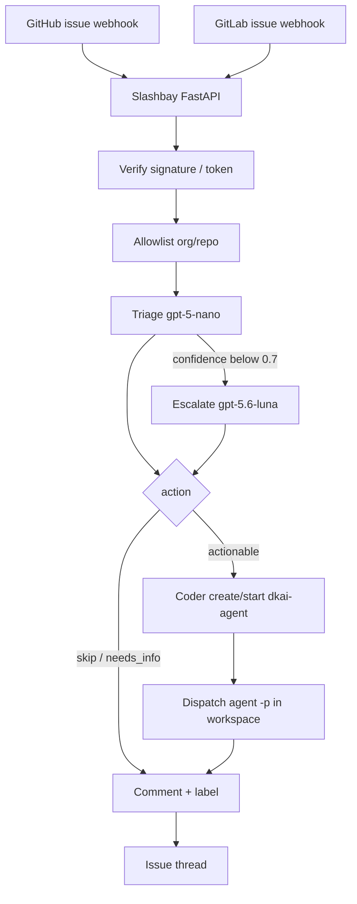
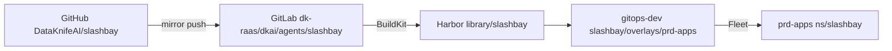

# Slashbay

**Slashbay** — DataKnifeAI’s issue-webhook herald: issues dock here, cheap-LLM triage decides if they are work, and a Coder workspace is berthed for a coding agent.

Slashbay owns **intake, classification, berth, and dispatch** for internal DataKnifeAI repositories. It is not a resold Cursor service. Cursor CLI is a coding worker we dispatch into, not the product identity.

| Sibling | Role vs Slashbay |
|---------|------------------|
| **[nauarchos](https://github.com/DataKnifeAI/nauarchos)** | Future Kubernetes fleet control plane (classes, sandboxes, on-demand workers). Slashbay is today’s herald on Coder; Nauarchos is the longer-term cluster admiral. |
| **[dioptra](https://github.com/DataKnifeAI/dioptra)** | Observe-only fleet status board. Slashbay acts; Dioptra watches. |

## What it does

1. Receive GitHub / GitLab **issue** webhooks
2. Cheap-LLM triage (OpenAI `gpt-5-nano`, escalate to `gpt-5.6-luna` when confidence is below 0.7)
3. If actionable: create/start a Coder workspace from the **`dkai-agent`** template
4. Dispatch coding via Cursor CLI (`agent -p`) **inside that workspace**
5. Comment and label the issue



## Integrations (reuse, do not copy)

| Repo | Why Slashbay talks to it |
|------|--------------------------|
| [coder-templates](https://github.com/DataKnifeAI/coder-templates) (`dkai-agent`) | Workspace template: Cursor CLI, tool PVC, `cursor_api_key` |
| [agent-workspace](https://github.com/DataKnifeAI/agent-workspace) | Default Cloud Agent / skills baseline the template can clone |
| [agent-skills](https://github.com/DataKnifeAI/agent-skills) | Shared skills installed in those workspaces |
| [gitops-dev](https://github.com/DataKnifeAI/gitops-dev) | Coder platform delivery |
| [rancher-deploy](https://github.com/DataKnifeAI/rancher-deploy) | Clusters the workspaces run on |
| [nauarchos](https://github.com/DataKnifeAI/nauarchos) | Future K8s fleet (not a runtime dependency today) |
| [dioptra](https://github.com/DataKnifeAI/dioptra) | Observe-only dashboard |

## Dispatch contract

Slashbay does **not** invent a Cursor worker pool. One named human seat, on-demand:

- Coder rich parameters: `cursor_api_key`, optional `cursor_worker_git_url` (issue repo, or `SLASHBAY_WORKSPACE_GIT_URL`)
- Workspace env: `SLASHBAY_DISPATCH=1`, `SLASHBAY_RUN_ID`, `SLASHBAY_ISSUE_URL`, `SLASHBAY_PROMPT`
- Command after the workspace is Started: `agent -p "$SLASHBAY_PROMPT"` (via `coder ssh` or a `dkai-agent` startup hook — request the hook in coder-templates if missing)
- Cap: `SLASHBAY_MAX_CONCURRENT` (2–5)

See `src/slashbay/dispatch/contract.py`.

## Cursor seat (internal)

- Cursor CLI is the **coding worker**, not the classifier
- One paid human user API key, suggested name **`dataknife-coder-issue-bot`**
- 2–5 concurrent jobs, on-demand usage on that seat
- Do **not** share one Pro key across a farm; do **not** create dummy bot seats
- Internal DataKnifeAI repos only

## Configure

Copy [`.env.example`](.env.example) to `.env`. Secrets never go in git.

| Variable | Purpose |
|----------|---------|
| `OPENAI_API_KEY` | Triage only. Unset → heuristic classifier (local/dev) |
| `CURSOR_API_KEY` | Injected into the Coder workspace as `cursor_api_key` |
| `GITHUB_WEBHOOK_SECRET` | HMAC for `X-Hub-Signature-256` |
| `GITLAB_WEBHOOK_TOKEN` | Shared token for `X-Gitlab-Token` |
| `CODER_ACCESS_URL` / `CODER_TOKEN` / `CODER_TEMPLATE` | Berth `dkai-agent` (default template name) |
| `SLASHBAY_REPO_ALLOWLIST` | `owner/name` or `owner/*` |
| `SLASHBAY_DRY_RUN` | Default `true`: no Coder or issue API calls |

Point GitHub/GitLab webhooks at:

- `POST /webhooks/github` (issues)
- `POST /webhooks/gitlab` (Issue Hook)
- `GET /healthz`

## Local run

Python 3.12+:

```bash
python3 -m venv .venv
source .venv/bin/activate
make install
cp .env.example .env   # set webhook secrets at minimum
make test
make run               # http://127.0.0.1:8080/healthz
```

Docker:

```bash
cp .env.example .env
docker compose up --build
```

## Deploy

GitHub is source of truth. GitLab is the Harbor build mirror only.



| Step | Where | What |
|------|--------|------|
| 1 | GitHub Actions | lint + pytest; on `main`, [reusable GitLab mirror](https://github.com/DataKnifeAI/github-workflows) force-pushes `dk-raas/dkai/agents/slashbay` |
| 2 | GitLab CI | `test` → BuildKit `publish` → Harbor `harbor.dataknife.net/library/slashbay:{latest,sha,tag}` |
| 3 | GitOps | Fleet applies [gitops-dev](https://github.com/DataKnifeAI/gitops-dev) path `slashbay/overlays/prd-apps` to cluster **prd-apps**, namespace **slashbay** |
| 4 | Secrets | Create `slashbay-secrets` and `harbor-registry-secret` in that namespace — see [deploy/secrets/README.md](deploy/secrets/README.md) |

This repo ships the same Kustomize tree under [deploy/](deploy/) (github-workflows default `kustomize_path`). **Do not** put Slashbay manifests in `rancher-deploy`. After the first Harbor image exists, pin the tag in **gitops-dev** `deployment.yaml` (siblings pin `high-command-*:v0.N`).

Webhook URLs (nginx Ingress, same `*.dataknife.net` pattern as Coder / MCP):

- `https://slashbay.dataknife.net/webhooks/github`
- `https://slashbay.dataknife.net/webhooks/gitlab`
- `https://slashbay.dataknife.net/healthz`

In-cluster: `http://slashbay.slashbay.svc.cluster.local`. If `slashbay.dataknife.net` is not reachable from GitHub/GitLab.com, use a Cloudflare Tunnel (high-command-ui) or a webhook relay — ClusterIP alone cannot receive those hooks.

Required secret keys: `OPENAI_API_KEY`, `CURSOR_API_KEY`, `CODER_TOKEN`, `GITHUB_WEBHOOK_SECRET`, `GITHUB_TOKEN`, `GITLAB_WEBHOOK_TOKEN`, `GITLAB_TOKEN`. Non-secret config is the `slashbay-config` ConfigMap (`CODER_ACCESS_URL` defaults to `https://coder.dataknife.net`). Leave `SLASHBAY_DRY_RUN=true` until secrets and Coder are ready.

## Layout

```
src/slashbay/
  app.py           # FastAPI: /healthz + webhooks
  service.py       # allowlist → triage → berth → comment
  webhooks/        # signature checks + event parse
  triage/          # structured {action, start_workspace, comment, confidence}
  coder/           # Coder API client (create/start)
  dispatch/        # agent -p contract
  state/           # issue ↔ run ↔ workspace (memory or sqlite)
  comments/        # GitHub/GitLab write-back
```

## License

Apache License 2.0. See [LICENSE](LICENSE).
